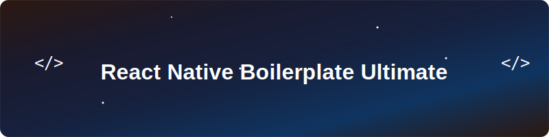

<div align="center">
  
</div>

# React Native Boilerplate

[](https://expo.dev/)
[](https://reactjs.org/)
[](https://reactnative.dev/)

_A comprehensive CLI tool for creating and managing React Native projects with modular architecture and best practices._

## Features

- Use Expo's pre-built native modules without ejecting
- Maintain full control over native code when needed
- Access Expo's development tools and services
- Easily integrate new Expo modules as they become available


Navigation:

[](https://reactnavigation.org/docs/getting-started/)
[](https://reactnavigation.org/docs/stack-navigator/) \
[](https://reactnavigation.org/docs/bottom-tab-navigator/)

Animation and UI:

[](https://github.com/th3rdwave/react-native-safe-area-context)
[](https://callstack.github.io/react-native-paper/) \
[](https://docs.swmansion.com/react-native-reanimated/)
[](https://shopify.github.io/react-native-skia/)

Capabilities:

[](https://github.com/react-native-sensors/react-native-sensors)
[](https://docs.swmansion.com/react-native-gesture-handler/)

State Management:

[](https://redux-toolkit.js.org/)
[](https://react-redux.js.org/)
[](https://github.com/LogRocket/redux-logger) \
[](https://github.com/rt2zz/redux-persist)
[](https://react-native-async-storage.github.io/async-storage/)

Performance:

[](https://shopify.github.io/flash-list/)
[](https://github.com/DylanVann/react-native-fast-image)

## Quick Start

### `init` - Create New Project

Create a new React Native project from the template:

```bash
npx @reuvenorg/react-native-boilerplate-ultimate init MyProject
```

**Options:**

- `-d, --destination <path>` - Destination directory (default: current directory)
- `--skip-install` - Skip npm install
- `-t, --template <name>` - Template variant to use (default: main)

**Examples:**

```bash
npx @reuvenorg/react-native-boilerplate-ultimate init MyAwesomeApp -d ~/Projects
```

```bash
npx @reuvenorg/react-native-boilerplate-ultimate init MyAwesomeApp -d /Users/username/Development --skip-install
```

## Project Commands

### `modules` - Manage Modules

Enable, disable, or check the status of project modules:

```bash
npx @reuvenorg/react-native-boilerplate-ultimate modules
```

**Options:**

- `-s, --status` - Show module status
- `-e, --enable <module>` - Enable a specific module or "all"
- `-d, --disable <module>` - Disable a specific module or "all"
- `--destination <path>` - Project directory path

**Available Modules:**

- `md-chat-ai-screen` - AI Chat functionality
- `md-redux-screen` - Redux example screen
- `md-skia-accelerometer-screen` - Skia accelerometer demo

**Examples:**

```bash
npx @reuvenorg/react-native-boilerplate-ultimate modules --status
npx @reuvenorg/react-native-boilerplate-ultimate modules --enable md-chat-ai-screen
npx @reuvenorg/react-native-boilerplate-ultimate modules --disable all
npx @reuvenorg/react-native-boilerplate-ultimate modules --status --destination ~/Projects/MyApp
```

### `icons` - Generate Icons

Generate app icons and splash screens:

```bash
npx @reuvenorg/react-native-boilerplate-ultimate icons
```

**Options:**

- `--android` - Generate Android icons only
- `--ios` - Generate iOS icons only
- `--splash` - Generate splash screens only
- `--primary <color>` - Primary color (default: #1976D2)
- `--background <color>` - Background color (default: #FFFFFF)
- `--destination <path>` - Project directory path

**Prerequisites:**
The target project must have the `canvas` package installed:

```bash
npm install canvas --save-dev
```

**Examples:**

```bash
npx @reuvenorg/react-native-boilerplate-ultimate icons --primary "#FF6B6B" --background "#FFFFFF"
npx @reuvenorg/react-native-boilerplate-ultimate icons --android
npx @reuvenorg/react-native-boilerplate-ultimate icons --splash
npx @reuvenorg/react-native-boilerplate-ultimate icons --primary "#2196F3" --destination /path/to/project
```

### `refresh` - Refresh Project

Refresh React Native project (clear cache, reinstall modules, etc.):

```bash
npx @reuvenorg/react-native-boilerplate-ultimate refresh
```

**Options:**

- `-w, --watchman` - Clear watchman watches only
- `-m, --modules` - Clean and reinstall node modules only
- `-s, --start` - Start with cache reset only
- `--destination <path>` - Project directory path

**Examples:**

```bash
npx @reuvenorg/react-native-boilerplate-ultimate refresh --watchman
npx @reuvenorg/react-native-boilerplate-ultimate refresh --modules
npx @reuvenorg/react-native-boilerplate-ultimate refresh  # Full refresh
npx @reuvenorg/react-native-boilerplate-ultimate refresh --modules --destination ~/MyProject
```

### `devices` - List Devices

List connected Android and iOS devices:

```bash
npx @reuvenorg/react-native-boilerplate-ultimate devices
```

**Options:**

- `-d, --details` - Show detailed device information
- `-a, --android` - Show Android devices only
- `-i, --ios` - Show iOS devices only
- `--destination <path>` - Project directory path (optional for devices command)

**Prerequisites:**

- **Android:** Android SDK platform tools (adb)
- **iOS:** Xcode Command Line Tools (xcrun)
- **iOS Details:** libimobiledevice (`brew install libimobiledevice`)

**Examples:**

```bash
npx @reuvenorg/react-native-boilerplate-ultimate devices --details
npx @reuvenorg/react-native-boilerplate-ultimate devices --android
npx @reuvenorg/react-native-boilerplate-ultimate devices --ios
```

## Usage Patterns

### Creating a New Project

```bash
# Create a new project
npx @reuvenorg/react-native-boilerplate-ultimate init MyProject

# Navigate to project
cd MyProject

# Check module status
npx @reuvenorg/react-native-boilerplate-ultimate modules --status

# Enable specific modules
npx @reuvenorg/react-native-boilerplate-ultimate modules --enable md-chat-ai-screen

# Generate custom icons
npx @reuvenorg/react-native-boilerplate-ultimate icons --primary "#FF6B6B"

# Check connected devices
npx @reuvenorg/react-native-boilerplate-ultimate devices
```

### Managing Existing Project

```bash
# Navigate to your project directory
cd MyExistingProject

# Enable all modules
npx @reuvenorg/react-native-boilerplate-ultimate modules --enable all

# Refresh project when having issues
npx @reuvenorg/react-native-boilerplate-ultimate refresh

# Generate new icons
npx @reuvenorg/react-native-boilerplate-ultimate icons --primary "#2196F3"
```

## Development

### Building the CLI

```bash
npm install
npm run build
```

## Template Documentation

### Modular Architecture

The template uses a **modular architecture** where features are organized as independent npm packages in a `modules/` directory. Each module is self-contained with its own dependencies and can be easily enabled or disabled. This approach provides:

- **Clean separation** of concerns
- **Easy maintenance** and updates
- **Selective feature inclusion** - only use what you need
- **Scalable codebase** structure

### Expo Modules Support

The template includes **full Expo modules support** with pre-configured integration:

- **Expo SDK compatibility** - Latest Expo modules work out of the box
- **Development build ready** - Configured for Expo Development Builds
- **EAS Build support** - Compatible with Expo Application Services
- **Hybrid workflow** - Mix Expo modules with native code seamlessly
- **Auto-linking** - Expo modules are automatically linked during setup

### Additional Resources

For detailed documentation about the React Native template structure, components, and features, see the [React Native Template repository](https://github.com/reuvenaor/react-native-template).

## Requirements

- Node.js >= 18
- React Native development environment
- For icons: `canvas` package in target project
- For devices: Platform-specific tools (adb, xcrun)

## Support

For issues and feature requests, please visit:
https://github.com/reuvenaor/@reuvenorg/react-native-boilerplate-ultimate/issues

## License

MIT
